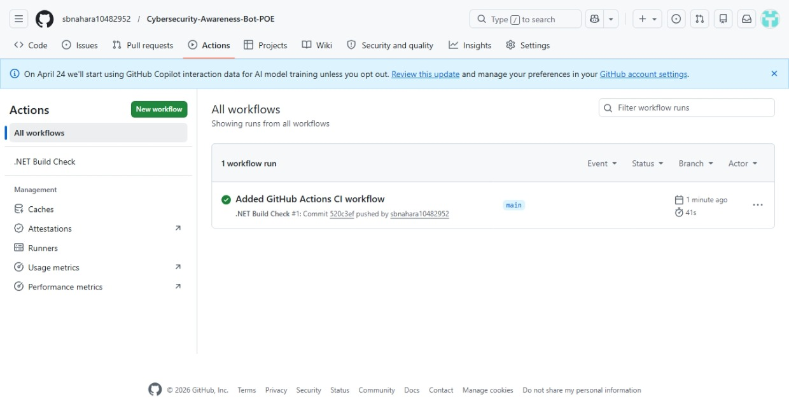

# Cybersecurity Awareness Bot 🔐

## 📌 Project Overview

This is a C# Console Application developed for PROG6221 Part 1 POE.

The chatbot helps users learn about:

- Password safety
- Phishing scams
- Safe browsing
- Suspicious links
- General cybersecurity awareness

## ✨ Features

- WAV voice greeting
- ASCII cybersecurity header
- Personalized name greeting
- Cybersecurity Q&A responses
- Input validation
- Colored console UI
- Structured classes and methods
- GitHub Actions CI workflow

## ▶️ How to Run

1. Open project in Visual Studio Code
2. Run:
   ```bash
   dotnet run
   ```



https://youtube.com/shorts/P2J2qFfkM4Q?si=nshCeuuSTeYwtjT2
